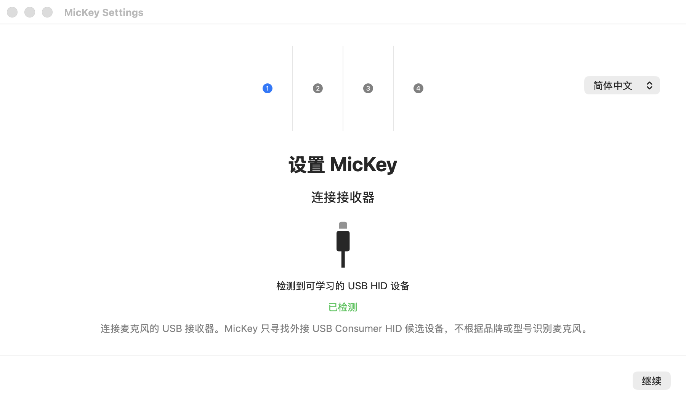
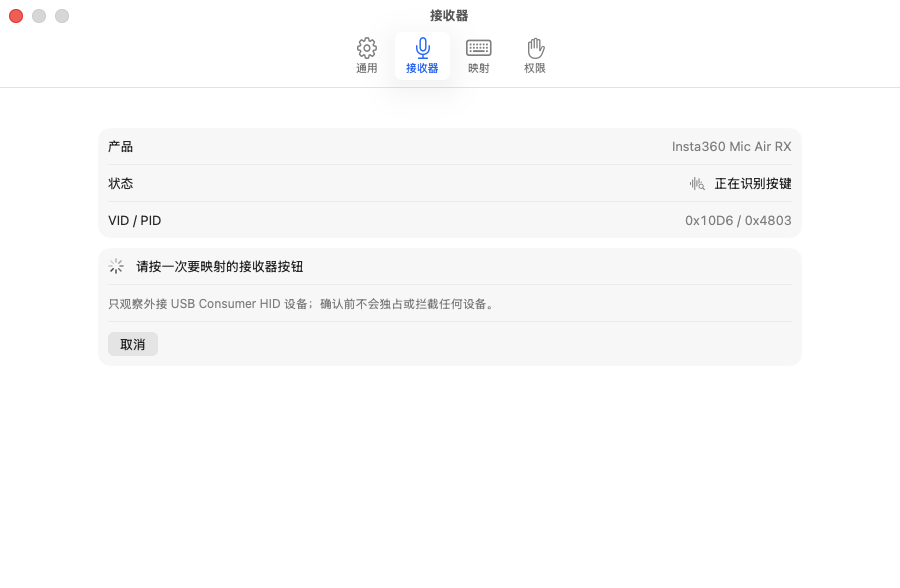
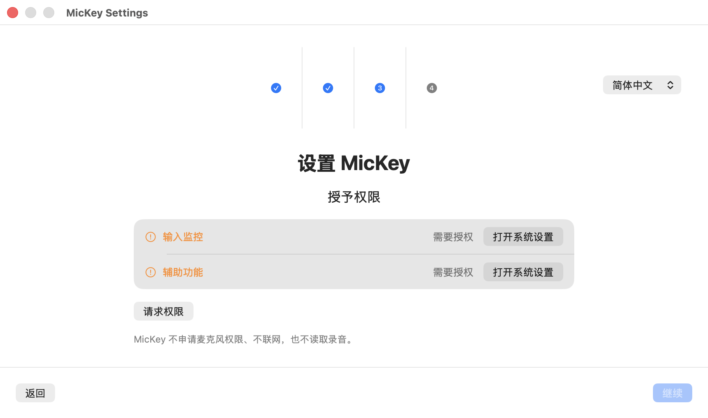
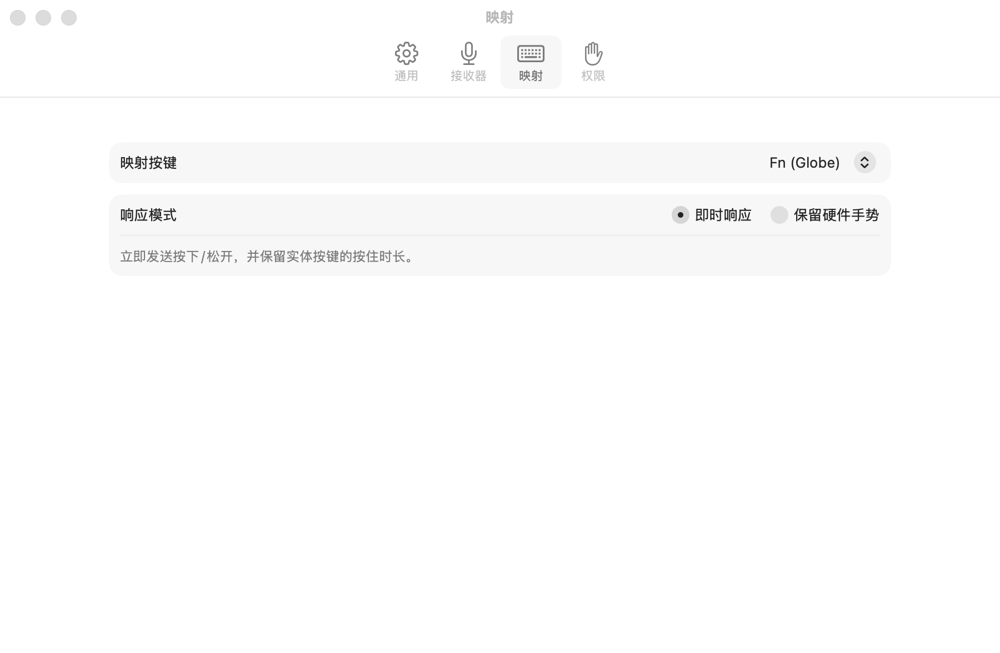

# MicKey

[](https://github.com/orange90/mickey2typeless/actions/workflows/ci.yml)
[](LICENSE)

[简体中文](README.md) | English

MicKey is a native macOS 26 menu bar app that maps a Consumer HID button on a microphone USB receiver to Fn (Globe), Escape, a function key, a letter or digit, or a custom shortcut. It uses IOKit and CoreGraphics directly, with no Karabiner, Hammerspoon, virtual keyboard driver, or built-in vendor/device allowlist.

## Features

- Simplified Chinese by default on first launch, with immediate Chinese/English switching under Settings → General → Language.
- Learns one external USB Consumer HID receiver button and saves its complete device fingerprint.
- Maps to Fn (Globe), common keys, F1–F20, letters, digits, or a shortcut with modifiers.
- Offers immediate output or a mode that preserves single-click, double-click, and hold hardware gestures.
- Ships as a native Universal 2 app and never accesses the network, recordings, or microphone permission.

## Typical use case

Map a physical button on the microphone to the Mac's Fn (Globe) key to trigger Typeless input without touching the computer keyboard.

## Installation

Download the latest signed and notarized DMG from [GitHub Releases](https://github.com/orange90/mickey2typeless/releases), move MicKey to Applications, and launch it. The first-run guide will request Input Monitoring and Accessibility permissions.

## How to use MicKey

### 1. Connect the receiver

Plug the microphone's USB receiver into your Mac before launching MicKey. The app appears in the menu bar and opens the setup guide on first launch. Click Continue when MicKey reports that it has detected a learnable USB HID device.



If the receiver remains undetected, it probably does not expose a Consumer HID button event that MicKey can read. A microphone working for audio recording does not guarantee that its physical buttons are compatible.

### 2. Identify the microphone button

On the Identify Button step, click Identify Receiver Button and press the physical microphone button you want to map once. MicKey then displays the product, manufacturer, VID/PID, Usage Page, and Usage. Confirm only after checking that the details belong to the connected receiver.



MicKey stores only the device fingerprint and button you explicitly confirm. It does not automatically claim another keyboard, mouse, or volume key. To use a different receiver, choose Forget Device under Settings → Receiver and repeat identification.

### 3. Grant the required permissions

Use the setup guide to allow MicKey under both macOS Input Monitoring and Accessibility. If the status does not update after granting access, quit and relaunch MicKey.



MicKey does not request microphone permission. It never reads audio or recordings; it only receives USB HID button events and emits the mapped keyboard event.

### 4. Map the button to Fn (Globe)

Open MicKey from the menu bar, then go to Settings → Mapping and set Map Button to `Fn (Globe)`. For Typeless, start with Immediate Response so the physical press and release durations are reproduced as Fn down and Fn up.



Choose Preserve Hardware Gestures only if you also need the microphone's original double- or triple-click actions. This mode starts output after a 180 ms hold and waits through a 320 ms decision window for a single click, so it adds a small delay.

### 5. Trigger Typeless from the microphone

1. Make sure Typeless is configured to use Fn as its trigger key.
2. Place the cursor in any text field.
3. Press the identified microphone button to start Typeless input exactly as if you had pressed Fn on the Mac keyboard. For press-and-hold input, keep holding the microphone button and release it when finished.

When everything is working, the MicKey menu bar status reads Mapping. If Typeless does not start, check that the receiver is still connected, both macOS permissions are granted, MicKey is mapped to `Fn (Globe)`, and Typeless itself uses Fn as its trigger.

## Microphone compatibility

Some wireless microphone USB receivers are composite devices: one interface carries audio, while another reports physical buttons as Consumer HID events. MicKey handles only the HID interface. A microphone working for audio recording does not guarantee that its buttons are compatible.

MicKey can potentially support any receiver that exposes an external USB Consumer HID interface and reports both button-down and button-up events to macOS. It does not support audio-only microphones, 3.5 mm microphones, Bluetooth-only microphones without a USB HID receiver, or buttons handled entirely by receiver firmware.

Learning mode observes only external USB Consumer HID devices on Usage Page `0x0C`. It excludes built-in devices, keyboards, trackpads, and clearly named virtual devices. You must press the target button and confirm the displayed product, manufacturer, VID/PID, Usage Page, and Usage before MicKey takes exclusive access. One receiver configuration can be stored at a time.

## Security and privacy boundary

- No vendor, product name, VID/PID, or Usage is built into the app, and an unconfirmed device is never claimed automatically.
- The stored fingerprint combines transport, product, manufacturer, VID, PID, Usage Page, and Usage. Serial numbers are not used.
- Only the confirmed Consumer HID interface is opened with `kIOHIDOptionsTypeSeizeDevice`; the audio interface is unaffected. Pausing, quitting, sleeping, or unplugging releases the interface.
- App Sandbox is disabled because low-level HID access is required. MicKey contains no networking code, requests no microphone permission, and reads no audio or recordings.

## Development

Requirements: Xcode 26, the macOS 26 SDK, and [XcodeGen](https://github.com/yonaskolb/XcodeGen).

```sh
xcodegen generate
DEVELOPER_DIR=/Applications/Xcode.app/Contents/Developer \
  xcodebuild -project MicKey.xcodeproj -scheme MicKey \
  -destination 'platform=macOS' build
```

Validate localizations and run tests:

```sh
./scripts/check_localizations.sh
DEVELOPER_DIR=/Applications/Xcode.app/Contents/Developer \
  xcodebuild -project MicKey.xcodeproj -scheme MicKey \
  -destination 'platform=macOS' test
```

`project.yml` is the source of truth for the generated Xcode project. The configured `arm64 x86_64` architectures produce a Universal 2 app.

## Release

After configuring a Developer ID Application certificate, development team, and `notarytool` keychain profile:

```sh
DEVELOPMENT_TEAM=YOUR_TEAM_ID \
NOTARY_PROFILE=YOUR_NOTARY_PROFILE \
./scripts/package_release.sh
```

The script archives, signs, packages, notarizes, and staples the app, then produces a versioned DMG and SHA-256 checksum in `release/`. See [RELEASE.md](RELEASE.md) for the full checklist.

## Contributing and license

See [CONTRIBUTING.md](CONTRIBUTING.md). Report security issues privately as described in [SECURITY.md](SECURITY.md). MicKey is available under the [MIT License](LICENSE).
